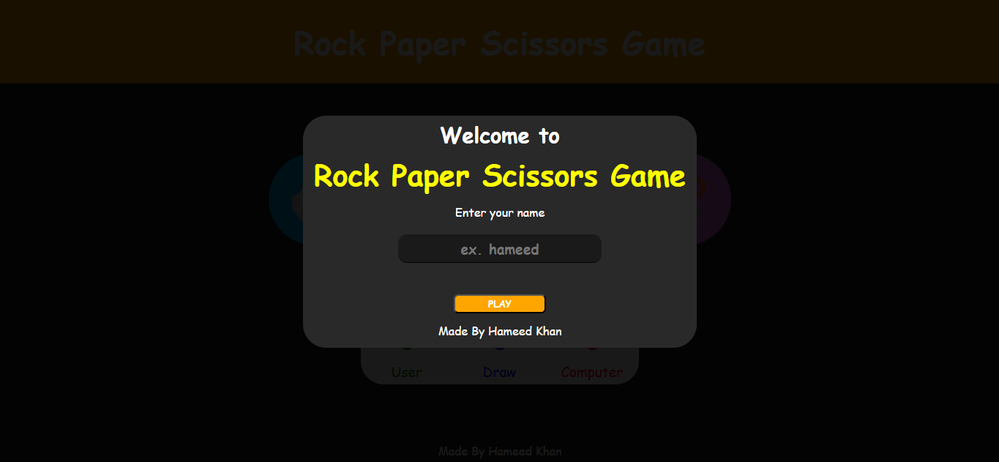
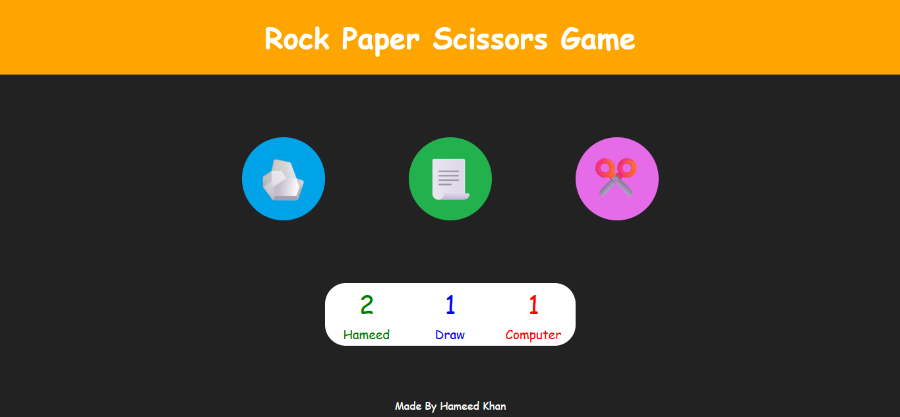
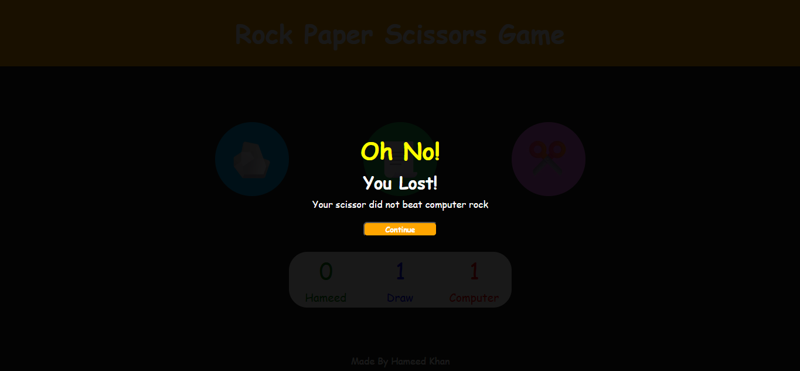

# 🎮 Rock Paper Scissors Game

This is a simple Rock Paper Scissors game that I built using **HTML, CSS, and JavaScript** to practice DOM manipulation and game logic.

The user enters their name, plays against the computer, and the scores are updated after every round. The game also shows a result overlay after each move.

---

## Live Demo

* Click: [Rock Paper Scissors Game](https://hameed-codes.github.io/Rock-Paper-Scissors-Game/) 

---

## Screenshots

---

## Features

* Start screen with name input
* Scoreboard (User / Computer / Draw)
* Result overlay after every round
* Random computer move generation
* Responsive layout (works on mobile and desktop)
* Clean UI with hover and click effects

---

## Technologies Used

* HTML5
* CSS3 (Flexbox, responsive units, hover effects)
* JavaScript (DOM manipulation, event listeners, game logic)

---

## How the Game Works

* Player selects Rock, Paper, or Scissors
* Computer randomly selects one option
* The winner is decided using conditional logic
* Scores are updated dynamically
* A result message is displayed after each round

---

## What I Learned

While building this project, I practiced:

* DOM selection and manipulation
* Handling user input
* Writing conditional game logic
* Updating UI dynamically
* Creating overlays
* Improving responsiveness for mobile devices

---

## Future Improvements

* Add sound effects
* Add a reset button
* Save score using local storage
* Add difficulty mode
* Improve UI design further

---

## Author

Made by Hameed Khan
